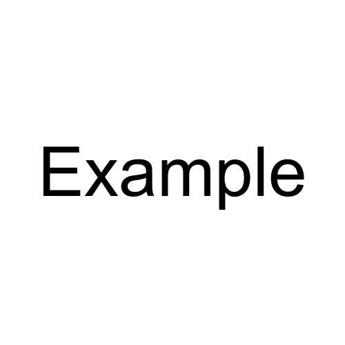

# Presentation title


## Slide 1

Content 1

Note: This will only appear in the speaker notes window.


## Slide 1.1

Content 1.1


## Slide 2

Content 2


## Headers

### h3
#### h4
##### h5


## Linebreaks

Leave two spaces  
at the end  
of the line to add  
linebreak


## Text formatting

**bold**  
*italic*  
~strikethrough~  
*You ~can't~ **can** combine them*


## Links

[RevealJS](https://github.com/hakimel/reveal.js)


## Images




## Lists
### Ordered

1. This is
2. an
3. ordered list


## Lists
### Unordered

* Can use asterisks
- or dashes
  * subitems use
    * indent


## Tasks lists

- [x] this is a complete item  
- [ ] this is an incomplete item  

Note: FIXME checkbox CSS


## Tables

| th1  | th2  |
| ---- | ---- |
| td11 | td21 |
| td12 | td22 |
| td13 | td23 |


## Code

```js
awesome() => {
  console.log('JavaScript is awesome!');
}
```


## Blockquotes

> If today were the last day of my life, would I want to do what I am about to do today?
> And whenever the answer has been No for too many days in a row, I know I need to change something.

— Steve Jobs

Note: TODO Enhance style


## RevealJS fragments

<p class="fragment grow">grow</p>
<p class="fragment shrink">shrink</p>
<p class="fragment fade-in">fade-in</p>
<p class="fragment fade-out">fade-out</p>


## RevealJS fragments

<p class="fragment fade-up">fade-up (also down, left and right!)</p>
<p class="fragment fade-in-then-out">fades in, then out when we move to the next step</p>
<p class="fragment fade-in-then-semi-out">fades in, then obfuscate when we move to the next step</p>
<p class="fragment fade-down">fade-down</p>


## RevealJS fragments

<p class="fragment highlight-current-blue">blue only once</p>
<p class="fragment highlight-red">highlight-red</p>
<p class="fragment highlight-green">highlight-green</p>
<p class="fragment highlight-blue">highlight-blue</p>

Note: TODO Add yellow highlight in CSS
